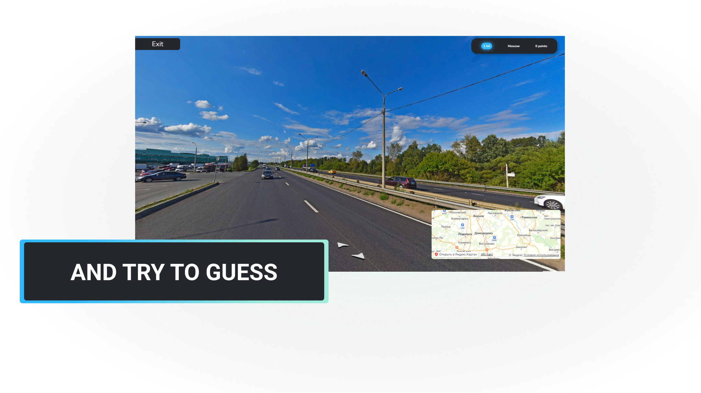
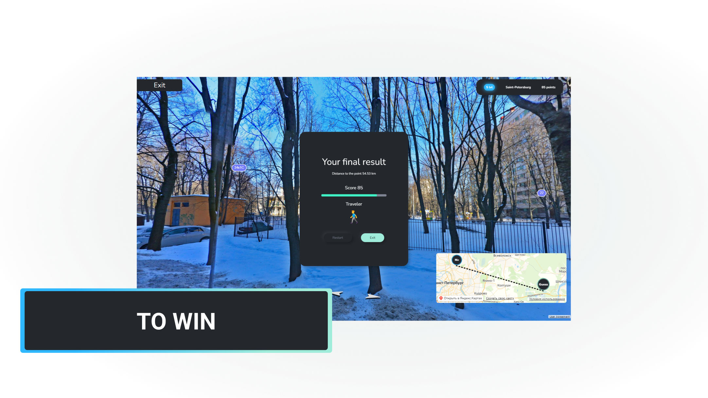

## Tech Stack

    

[OpenStreetMap](https://www.openstreetmap.org/#map=3/69.62/-74.90) - non-commercial web mapping project.

## How to start

### `npm i`

### `npm run start`

#

#

> Note: Use `--force` if you have problems installing packages
